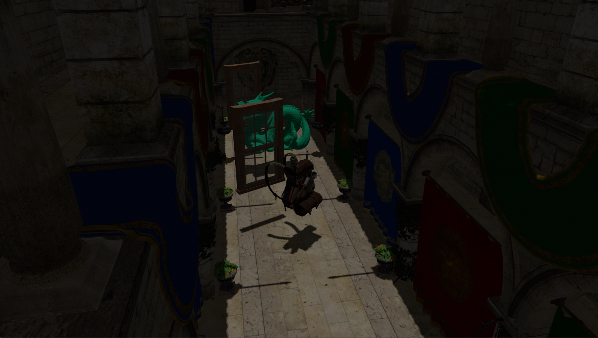
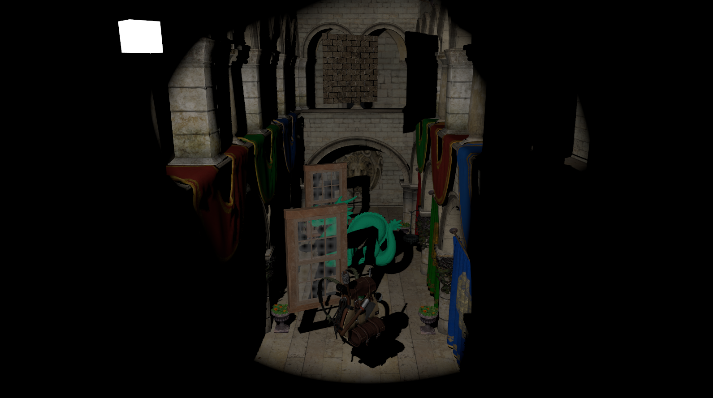
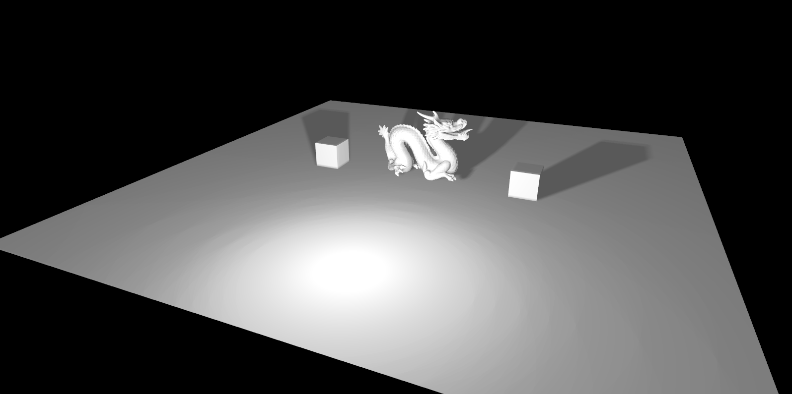

# Vulkan Application

## Samples Screenshots

### Directional Light Shadow Map

### Spot Light Shadow Map

### Point Light Shadow Map

## Current Work (not in order)

- [x] Depth Buffer 
- [x] Texture 
- [x] Camera class
	- [x] Movement 
	- [x] Turn Movement
	- [x] Based on Input
- [x] Custom Model loading
- [x] Proper Model/Material/Shader/Texture Set
- [x] Single Buffer for Vertices and Indices 
- [x] Single Buffer for uniforms
- [x] Empty Scene
- [x] Send Array of Materials to Shader 
	- [x] Send Array of Textures to Shader
	- [x] Send one array of textures/material and the index to be used per material
- [x] Mipmaps
- [x] Multisampling
- [x] Custom meshes I
	- [x] Individual Cells Plane 
	- [x] Unique Cells Plane 
	- [x] Cube
- [x] glTF
- [x] Cubemap/Skybox 
- [x] Lighting
	- [x] Directional Light
	- [x] Point Light
	- [x] Spot Light
	- [x] Blinn-Phong
- [x] Stencil Buffer
- [x] Runtime Shader Compilation (Partially)
	- To avoid adding another dependency (glslang or shaderc), I decided to use VulkanSDK glslang,
	  however, the SDK version is built using MSVC compiler, not being compatible with code built
	  using Ninja or MinGW compiler, therefore the runtime shader compilation will only work when
	  built using MSVC compiler.
- [x] Blending
- [x] Framebuffers
- [x] Instancing
- [ ] Shadows
	- [x] Directional
	- [x] Spot
	- [ ] Point
	- [ ] Multiple Lights
		- [x] Spot
		- [x] Directional
		- [ ] Point
	- [ ] Automatic light frustum
	- [ ] Soft Shadows

## Next Up
- [ ] Parallax Mapping
- [ ] HDR
- [ ] Bloom
- [ ] Defferred Shading
- [ ] SSAO
- [ ] PRB
- [ ] Refactoring

## Planning 
- [ ] Shader Include
- [ ] Generate Normals (Mesh Generator) 
- [ ] Compute Shaders
- [ ] GPU Driven Rendering
- [ ] Ray Tracer
- [ ] Render Graph
- [ ] Scene selection
- [ ] Custom meshes II 
	- [ ] Sphere
	- [ ] Voxel

## Small problems to remember to solve

- [ ] Add material instance per object and bind if from there to have customized properties of the same material

