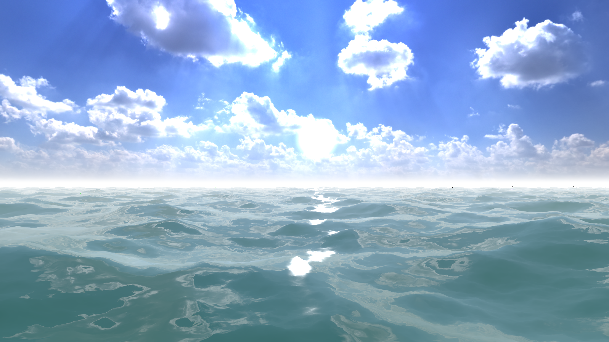
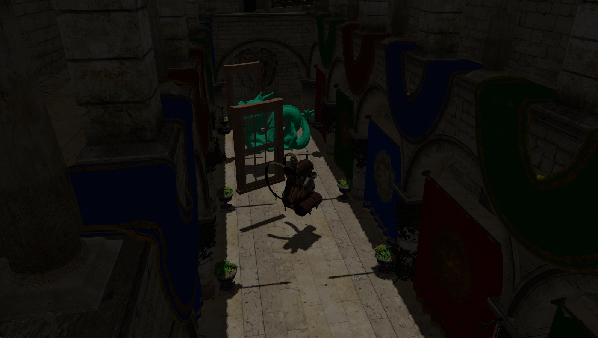
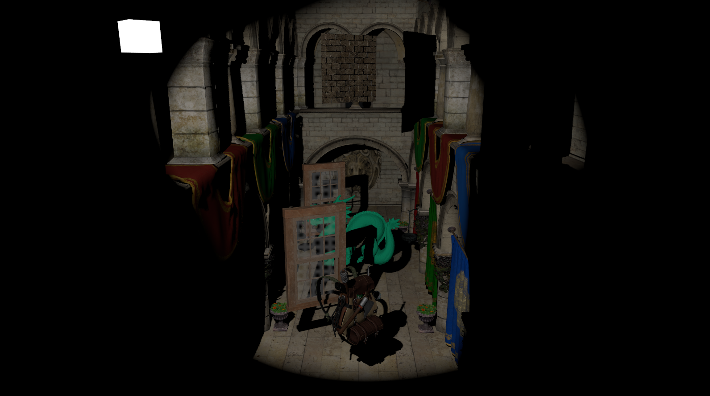
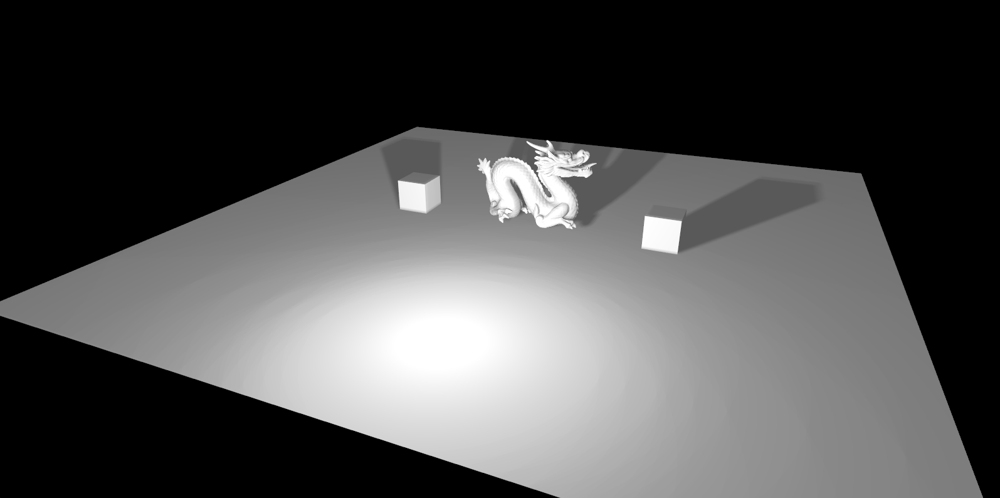
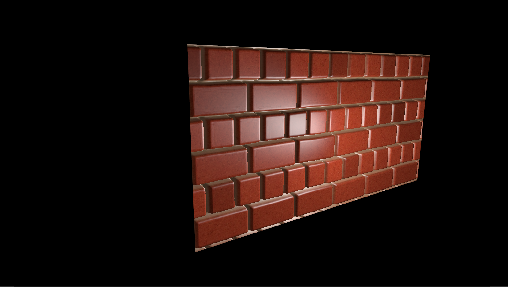
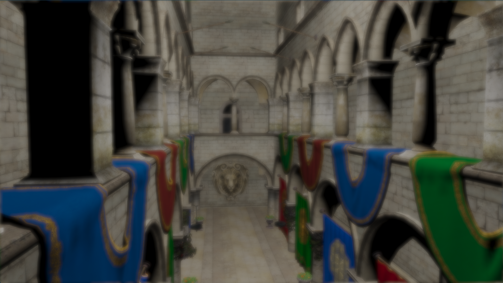
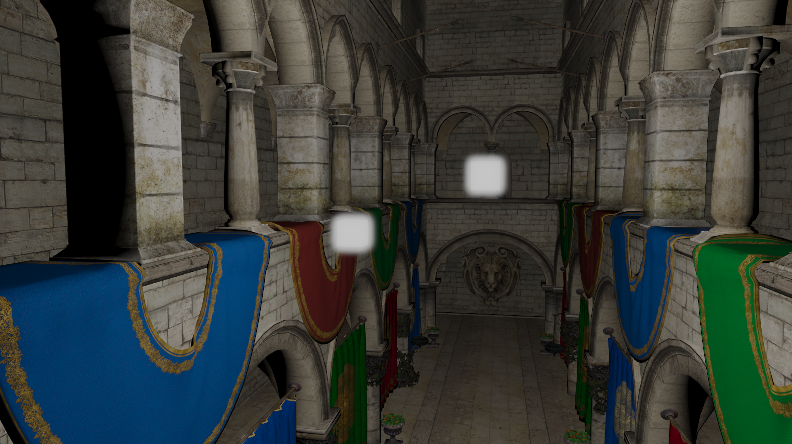
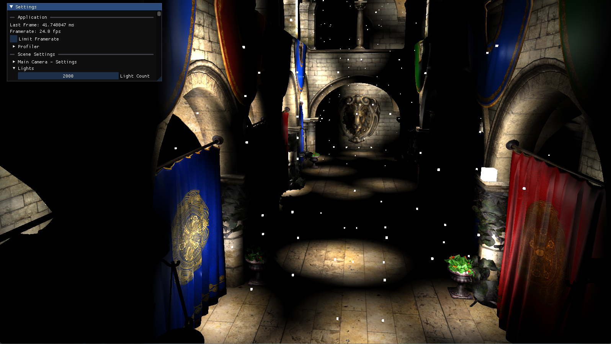
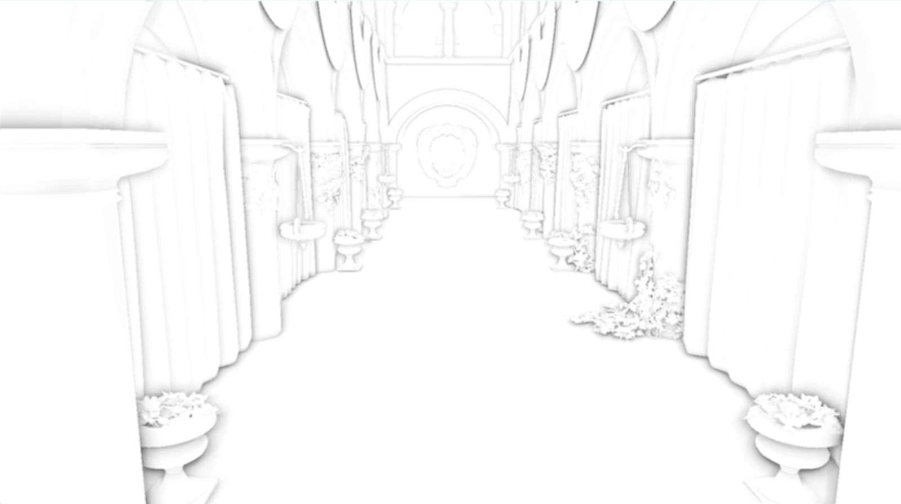

# Vulkan Application

## Samples Screenshots

### Water Surface Rendering

### Directional Light Shadow Map

### Spot Light Shadow Map

### Point Light Shadow Map

### Parallax Mapping

### Gaussian Blur - Full Screen Blur

### Gaussian Blur - Bloom

### Deferred Rendering (with light volume optimization)

### SSAO (with position reconstruction from depth optimization)

